# Tài Liệu Bằng Chứng W7 - StudyBot / Trợ Lý Học Tập AI

> Trạng thái: bản nháp cho lần nộp cuối cùng. Thay thế mọi `TODO` bằng giá trị triển khai thực tế và thêm ảnh chụp màn hình vào thư mục ``.

## 1. Trang Bìa

| Trường | Giá trị |
|---|---|
| Nhóm | 15 |
| Thành viên | Phạm Vũ Khánh Trường, Phan Anh Duy, Ka Phu Đông, Võ Lê Trường Huy, Hà Tây Nguyên, Nguyễn Thị Tiểu Phương, Nguyễn Đình Thi, Văn Phú Tín, Châu Thành Trung |
| Lĩnh vực | EduTech - Trợ Lý Học Tập AI |
| Ca sử dụng | Tải lên file PDF/slide/ghi chú văn bản bài giảng, sau đó đặt câu hỏi, tạo flashcard/bài kiểm tra và tiếp tục học từ trạng thái đã lưu. |
| URL công khai | https://xmind.click/ |
| API URL | `https://1lse4odraj.execute-api.ap-southeast-1.amazonaws.com` |
| GitHub repo | https://github.com/x-brain-group-15/hackathon-edutech |
| AWS region | `ap-southeast-1` |
| Tổng chi phí | TODO: USD từ ảnh chụp màn hình Cost Explorer cuối cùng |
| Video demo | TODO: `docs/demo.mp4` hoặc liên kết YouTube không công khai |

Ảnh chụp màn hình bắt buộc cho phần này:
- `01_live_url_loaded.png` - ứng dụng HTTPS hiển thị cho người đánh giá được tải trên trình duyệt.
- `02_repo_readme.png` - repo GitHub công khai với README, kiến trúc, hướng dẫn cài đặt, dọn dẹp.

## 2. Bài Thuyết Trình và Tầm Nhìn

StudyBot giúp người học biến tài liệu bài giảng thành các tài sản học tập chủ động. Người học tải lên một file PDF, file xuất từ slide, hoặc ghi chú dạng văn bản, sau đó nhận được phần hỏi đáp bám sát nội dung, flashcard, bài kiểm tra, ghi chú Cornell và phản hồi đánh giá chất lượng truy xuất từ chính tài liệu học tập đó.

Đối tượng người dùng mục tiêu là sinh viên đại học, người tự học và những người ôn thi đã có sẵn ghi chú nhưng mất thời gian chuyển đổi chúng thành quy trình ôn tập. Dự án này quan trọng vì một sản phẩm hữu ích không chỉ là "trò chuyện với PDF"; nó là một vòng lặp học tập: tải lên, đặt câu hỏi, tạo tài liệu ôn tập, ôn tập, và quay lại sau với trạng thái được giữ nguyên.

Ảnh chụp màn hình bắt buộc:
- 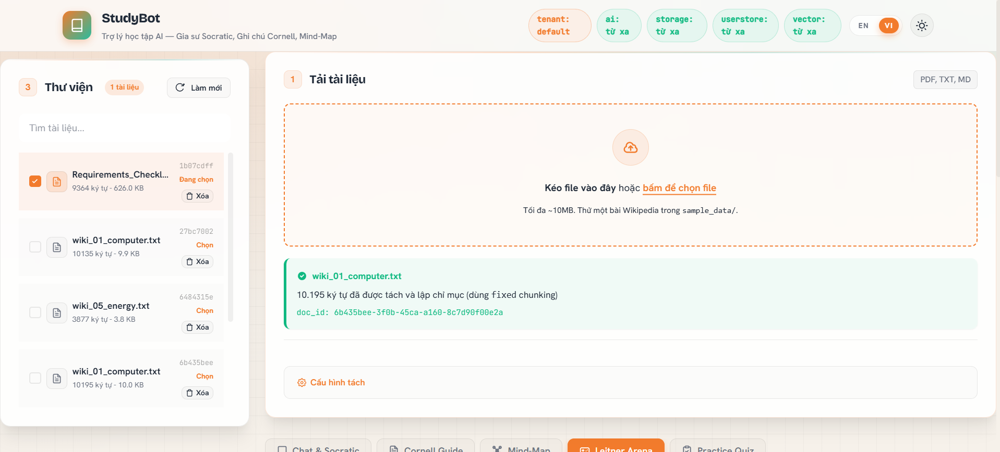 - chọn/tải file lên thành công.
- 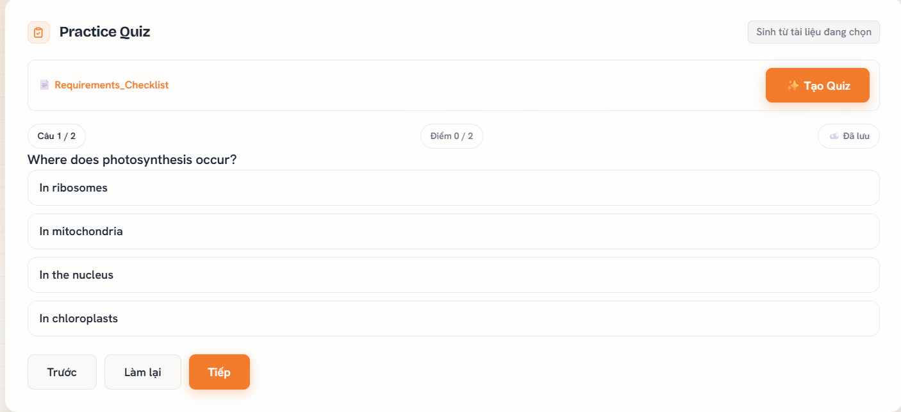 - câu trả lời hỏi đáp được tạo từ tài liệu đã tải lên.
- 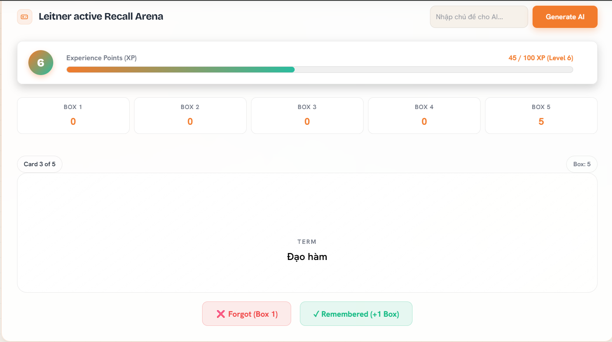 - flashcard/bài kiểm tra được tạo hiển thị trên UI.

## 3. Kiến Trúc

### Sơ Đồ Cuối Cùng

.

Kiến trúc được triển khai là serverless (không máy chủ):

| Năng lực | Dịch vụ sử dụng | Bằng chứng |
|---|---|---|
| 1. Giao diện người dùng | CloudFront + S3 static frontend, deploy ngoài SAM backend stack | - 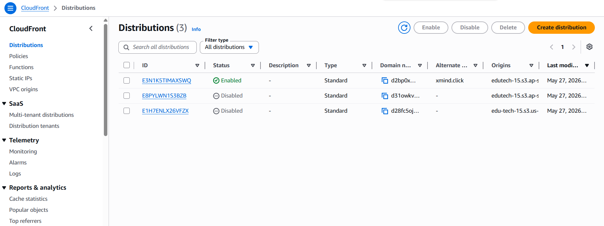 |
| 2. Tính toán ứng dụng | API Gateway HTTP API + AWS Lambda (`studybot-query`, `studybot-upload`, `studybot-core`) | - 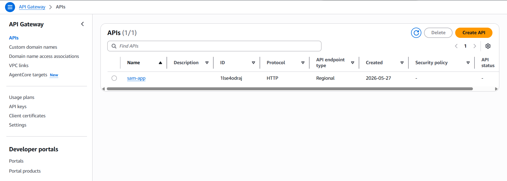  |
| 3. Tính năng AI / ML | Amazon Bedrock Claude Sonnet theo `samconfig.toml` hiện tại + Bedrock Knowledge Base / gọi trực tiếp InvokeModel làm dự phòng | TODO: quyền truy cập mô hình Bedrock + kết quả UI |
| 4. Lưu trữ dữ liệu | DynamoDB (trạng thái người dùng/tài liệu/truy vấn); S3 JSON cho quiz đã lưu; tài liệu upload lưu trong S3 | TODO: ảnh chụp màn hình item DynamoDB + đối tượng S3 |
| 5. Lưu trữ Object | Bucket S3 cho tài liệu và bucket S3 cho flashcard/bài kiểm tra | -   |
| 6. Nền tảng mạng | VPC, private subnet, Lambda SG, S3/DynamoDB gateway endpoints, Bedrock interface endpoints |  - 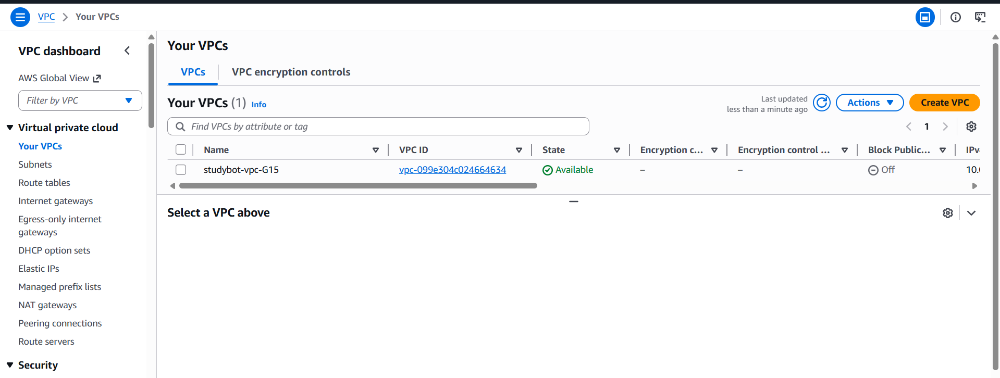  - 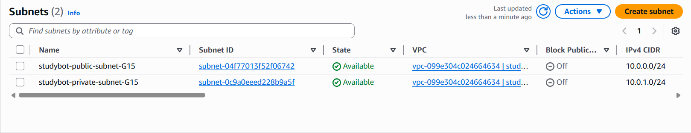  - 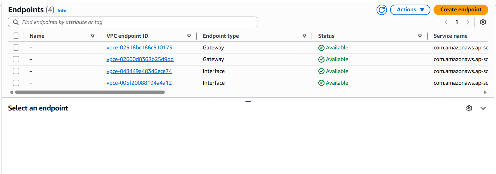 |
| 7. Danh tính & truy cập | Vai trò thực thi Lambda cấp quyền tối thiểu (IAM least-privilege); người dùng demo thông qua `X-User-Id` | TODO: ảnh chụp màn hình IAM policy |

### Các Quyết Định Dịch Vụ

| Quyết định | Lựa chọn | Lý do |
|---|---|---|
| Tính toán | Chia Lambda thành các hàm query/upload/core | Giữ chi phí lúc rảnh gần như bằng 0 và cho phép các route tải lên/AI nặng có thời gian timeout dài hơn mà không cần tăng kích thước cho các route health/list. |
| Cổng API | API Gateway HTTP API | Rẻ và đơn giản hơn REST API cho ứng dụng request/response này. |
| Frontend | S3 + CloudFront | HTTPS công khai, chi phí thấp, không cần quản lý máy chủ. |
| Database | DynamoDB on-demand | Các mẫu truy cập là dạng key-value/trạng thái người dùng-tài liệu; không cần kết nối quan hệ cho bản demo. |
| Lưu trữ Object | S3 | PDF, nội dung trích xuất, và JSON quiz đã lưu đều là dữ liệu blob/tài liệu. |
| Mô hình AI | Claude 3.5 Sonnet theo cấu hình deploy hiện tại | Chất lượng câu trả lời tốt hơn cho demo cuối; nếu chi phí là ưu tiên chính thì đổi `AiModelId` về Haiku và cập nhật evidence. |
| RAG | Bedrock Knowledge Base, kết hợp dự phòng từ khóa nội bộ trong code | Câu trả lời bám sát tốt hơn khi KB sẵn sàng; dự phòng giúp đường dẫn demo vẫn hoạt động nếu việc nhập dữ liệu vào KB gặp sự cố. |
| Mạng | Private Lambda subnet + VPC endpoints, không dùng NAT Gateway | Gateway endpoints cho S3/DynamoDB là miễn phí; interface endpoints cho Bedrock giúp tránh chi phí cố định của NAT. |
| Giám sát | Dashboard CloudWatch, cảnh báo, log, custom metrics | Cung cấp bằng chứng vận hành và hỗ trợ tùy chọn Full Observability (Khả năng quan sát toàn diện). |
| IaC | AWS SAM / CloudFormation trong `template.yaml` | Triển khai có thể lặp lại và dễ dàng dọn dẹp thông qua việc xóa stack. |

### Sự Đánh Đổi

1. Lambda so với EC2/ECS: chọn Lambda vì tốc độ trong 48 giờ và chi phí rảnh thấp. Chấp nhận các hạn chế về thời gian khởi động lạnh (cold start) và giới hạn timeout.
2. DynamoDB so với RDS: chọn DynamoDB vì trạng thái người dùng và metadata tài liệu là những mẫu truy cập đơn giản. Chấp nhận khả năng truy vấn đột xuất (ad-hoc) yếu hơn.
3. Bedrock KB so với gọi InvokeModel trực tiếp: chọn KB để truy xuất bám sát nội dung. Giữ phương án dự phòng gọi trực tiếp/cục bộ vì thiết lập và nhập dữ liệu KB có thể là phần phụ thuộc rủi ro nhất khi demo.

### Luồng Upload PDF và Trích Xuất Nội Dung

Chức năng upload PDF là điểm vào chính của StudyBot. Người dùng chọn file PDF/TXT/MD trên frontend, browser gọi `POST /upload` qua API Gateway, Lambda `studybot-upload` nhận file, lưu bản gốc vào storage, trích xuất nội dung, ingest vào vector store, lưu metadata tài liệu theo `user_id`, rồi trả `doc_id` cho UI.

Luồng xử lý thực tế:

```text
Frontend chọn PDF
-> POST /upload kèm X-User-Id
-> Lambda lưu file gốc vào S3/local storage
-> Nếu là PDF: chạy hybrid PDF extraction
-> Lưu extracted_text.txt và extracted image/chart assets
-> Ingest text vào vector store / retrieval fallback
-> Lưu metadata tài liệu vào userstore/DynamoDB
-> Ghi DOCUMENT_UPLOAD và PROCESS_STEP log lên CloudWatch
-> Trả doc_id, location, chars_extracted, extraction metadata về frontend
```

**Chiến lược hybrid PDF extraction**

Nhóm không OCR/Textract toàn bộ PDF ngay từ đầu vì nhiều file slide đã có text layer đọc được bằng `pypdf`. Pipeline hiện tại dùng chiến lược:

1. Đọc text layer từng page bằng `pypdf`.
2. Đếm image object trên mỗi page để nhận biết slide nhiều hình/biểu đồ.
3. Extract image/chart asset từ PDF qua cùng storage adapter với file gốc.
4. Bỏ ảnh nhỏ dưới `8KB` để tránh lưu logo/icon/mask không hữu ích.
5. Deduplicate ảnh bằng SHA-256 trên toàn document để bỏ background/asset lặp lại.
6. Page có đủ text thì ingest text layer trực tiếp.
7. Page ít text nhưng có ảnh thì đánh dấu `needs_ocr_or_textract`.
8. Trả về text chuẩn hóa, metadata theo page, S3/local URI của visual assets.

Tên strategy trong response và metadata:

```text
hybrid_text_layer_plus_image_assets_then_page_level_ocr
```

**Cấu trúc object lưu trữ**

Ví dụ với `user_id = test-user-001`, một `doc_id` bất kỳ và file `W6_Operations.pdf`:

```text
Original PDF:
test-user-001/{doc_id}/W6_Operations.pdf

Bedrock KB metadata:
test-user-001/{doc_id}/W6_Operations.pdf.metadata.json

Extracted plain text:
test-user-001/{doc_id}/extracted_text.txt

Filtered image/chart assets:
test-user-001/{doc_id}/extracted-assets/page_001_image_001.png
```

Khi `STORAGE_BACKEND=local`, location trả về dạng `file://...`. Khi `STORAGE_BACKEND=s3`, location trả về dạng `s3://bucket/...`.

**Metadata trả về sau upload**

```json
{
  "doc_id": "generated-doc-id",
  "filename": "W6_Operations.pdf",
  "size": 7497312,
  "chars_extracted": 5671,
  "location": "s3://studybot-uploads/test-user-001/generated-doc-id/W6_Operations.pdf",
  "extraction": {
    "page_count": 20,
    "chars_extracted": 5671,
    "images_extracted": 27,
    "pages_requiring_ocr": [20],
    "pages_with_images_or_charts": [1, 2, 3],
    "pages_with_table_like_content": [],
    "strategy": "hybrid_text_layer_plus_image_assets_then_page_level_ocr",
    "asset_prefix": "test-user-001/generated-doc-id/extracted-assets"
  }
}
```

**Kết quả test đã chạy**

| Test file | Page count | Chars extracted | Images extracted | Pages requiring OCR/Textract | Kết luận |
|---|---:|---:|---:|---|---|
| `tests/W6_Operations_Hardening_&_Cost-Aware_Cloud_-_Nhóm_15.pptx.pdf` | 20 | 5671 | 27 | `[20]` | Slide có nhiều ảnh, chỉ page 20 cần OCR/Textract. |
| `tests/SCA_KLTN_Nhom30_3.ProjectUserStrory.pdf` | 25 | khoảng 36,000 | 2 | `[]` | PDF có text layer tốt, không cần OCR. |

Ảnh filtering trên file W6 giảm từ `83` raw image objects xuống `43` sau size filter, rồi còn `27` sau size filter + dedup. Điều này giảm noise và giảm số object cần lưu, nhưng vẫn giữ được hình/biểu đồ quan trọng để downstream retrieval có thể tham chiếu.

**Bằng chứng trong repo**

- `docs/pdf_extraction.md` - mô tả chi tiết chiến lược hybrid extraction, output shape, trade-off và kết quả test.
- `src/pdf_extractor.py` - implementation đọc PDF, lọc ảnh `8KB`, dedup SHA-256, đánh dấu page cần OCR/Textract.
- `src/handlers.py` - tích hợp upload: lưu file gốc, metadata `.metadata.json`, `extracted_text.txt`, extracted assets, ingest vector store, lưu metadata user.
- `lambda_upload.py` - route Lambda/FastAPI `POST /upload` nhận file và gọi `handle_upload`.
- `tests/test_pdf_extractor.py` - test metadata cho PDF ít text.

### Luồng Xử Lý End-to-End

Đây là luồng ứng dụng thực tế mà demo cần chứng minh, không chỉ là danh sách dịch vụ.

#### Luồng 1 - Mở ứng dụng công khai

1. Học sinh mở URL HTTPS cuối cùng của frontend, ưu tiên CloudFront nếu phần deploy frontend riêng đã hoạt động.
2. CloudFront phục vụ HTML/CSS/JS tĩnh từ S3 frontend bucket.
3. Trình duyệt gọi API Gateway bằng API base URL đã cấu hình.
4. API Gateway điều hướng các request nhẹ như `/health`, `/docs/list`, và `/queries/recent` đến Lambda `studybot-core`.

Bằng chứng cần chụp:
- `01_live_url_loaded.png` - URL CloudFront đang mở trong browser.
- `07_api_gateway_routes.png` - các route API Gateway trỏ đến Lambda.
- `09_cloudformation_stack_outputs.png` - API URL và stack outputs sau khi deploy.

#### Luồng 2 - Upload và index tài liệu học tập

1. Học sinh upload PDF/TXT/slide export từ UI StudyBot.
2. Browser gửi `POST /upload` đến API Gateway kèm `X-User-Id`.
3. API Gateway invoke Lambda `studybot-upload`.
4. Lambda trích xuất text và metadata của tài liệu.
5. Lambda lưu file gốc và artifact đã trích xuất vào S3.
6. Lambda lưu metadata tài liệu theo user vào DynamoDB.
7. Nếu Bedrock Knowledge Base đã cấu hình, nội dung tài liệu được chuẩn bị cho retrieval/indexing; nếu KB gặp lỗi, fallback keyword/local vector vẫn giữ được happy path Q&A.
8. Lambda ghi log và metric vào CloudWatch.

Với PDF, Lambda không OCR toàn bộ file ngay từ đầu. Pipeline dùng `pypdf` để lấy text layer trước, extract image/chart assets vào `extracted-assets`, bỏ ảnh nhỏ dưới 8KB, dedup ảnh bằng SHA-256, và chỉ đánh dấu các page ít text có ảnh là `needs_ocr_or_textract`. Test W6 cho thấy 20 pages, 5671 chars, 27 image assets sau filter/dedup, và chỉ page 20 cần OCR/Textract.

Bằng chứng cần chụp:
- `03_upload_flow.png` - upload thành công trên UI.
- `36_s3_uploaded_document.png` - object tài liệu trong S3.
- `26_dynamodb_items.png` - metadata tài liệu trong DynamoDB.
- `22_log_insights_query.png` - log upload trong CloudWatch.

#### Luồng 3 - Hỏi đáp có grounding bằng RAG

1. Học sinh đặt câu hỏi trong chat UI.
2. Browser gửi `POST /query` đến API Gateway.
3. API Gateway invoke Lambda `studybot-query`.
4. Lambda xác định user hiện tại và tài liệu đang chọn.
5. Lambda retrieve context liên quan từ Bedrock Knowledge Base hoặc fallback local/vector path.
6. Lambda gọi model Bedrock đang cấu hình trong `samconfig.toml` với câu hỏi và context đã retrieve.
7. Lambda trả câu trả lời và context/citation về browser.
8. Lambda lưu recent query vào DynamoDB và publish metric độ trễ như `SocraticQueryLatency`.

Bằng chứng cần chụp:
- `04_ai_answer_with_context.png` - câu trả lời hiển thị trên UI.
- `24_bedrock_model_answer.png` - câu trả lời từ Bedrock thật.
- `23_custom_metrics.png` - custom metric `SocraticQueryLatency`.
- `27_docs_list_persistence.png` - tài liệu/query cũ vẫn còn hiển thị.

#### Luồng 4 - Tạo flashcards và quiz

1. Học sinh chọn tài liệu và bấm Generate AI / Generate Quiz.
2. Browser gửi `POST /flashcards` hoặc `POST /quiz` đến API Gateway.
3. API Gateway invoke Lambda `studybot-query`.
4. Lambda tạo prompt từ context của tài liệu đang chọn và yêu cầu Bedrock trả về JSON có cấu trúc.
5. Lambda validate/parse JSON sinh ra.
6. Với quiz, Lambda lưu JSON vào flashcard S3 bucket theo key user và document.
7. Với flashcards, backend hiện tại trả JSON về UI và publish CloudWatch metrics; không claim S3 persistence cho flashcards nếu chưa implement save/load.
8. UI render bộ học tập đã sinh; `GET /quiz/{doc_id}` có thể load lại quiz đã lưu.

Bằng chứng cần chụp:
- `05_flashcards_or_quiz.png` - flashcard/quiz hiển thị trên UI.
- `37_s3_quiz_json.png` - JSON quiz đã lưu trong S3.
- `23_custom_metrics.png` - `FlashcardGenerationLatency` hoặc `FlashcardGenerationSuccess`.

#### Luồng 5 - Quay lại session mới và kiểm tra persistence

1. Học sinh refresh browser hoặc mở session mới.
2. Browser gọi `/docs/list`, `/queries/recent`, và endpoint quiz đã lưu.
3. Lambda core/query đọc user state từ DynamoDB và quiz JSON từ S3.
4. UI hiển thị tài liệu đã upload, recent query, và quiz đã lưu. Flashcards hiện là generated-on-demand trừ khi save/load flashcard S3 được implement.

Bằng chứng cần chụp:
- `28_fresh_session_persistence.png` - session mới vẫn thấy dữ liệu cũ.
- `26_dynamodb_items.png` - record user/document đã persist.
- `37_s3_quiz_json.png` - artifact quiz đã persist trong S3.

Ảnh chụp màn hình bắt buộc:
- `07_api_gateway_routes.png`

## 4. Kiểm Soát Chi Phí

### Ảnh Chụp Màn Hình Chi Phí

| Thời gian | Ảnh chụp màn hình | Ghi chú |
|---|---|---|
| Cuối Ngày 1 - 2026-05-27 | 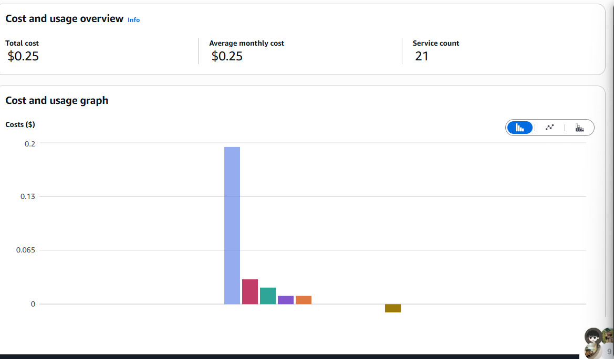 |0.25$ - Top3: WAF, KMS, S3|
| Cuối Ngày 2 - 2026-05-28 | 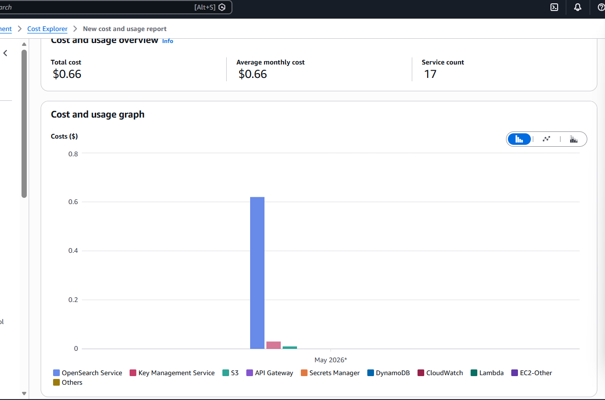 |0.66$ - (Top3: OpenSearch Service, KMS, S3)|
| Sáng ngày Demo - 2026-05-29 | `cost_demo_morning.png` | TODO: tổng trước khi demo |

### Các Yếu Tố Tốn Kém Nhất

| Hạng | Dịch vụ | Chi phí | Lý do xuất hiện |
|---|---:|---:|---|
| 1 | Open Search Service |  | Lượng truy vấn nhiều vào Knowledge Base |
| 2 | KMS |  | Cần lưu trữ các key mã hoá |
| 3 | S3 |  | Người dùng Upload và lưu trữ các bài tập hoặc thẻ ghi nhớ |

### Các Biện Pháp Kiểm Soát Chi Phí

- Minh chứng budget phải thể hiện đúng yêu cầu W7: cảnh báo `$80` và SNS email đã confirm. `template.yaml` hiện đã định nghĩa budget `$100` với threshold `80%`, tương ứng cảnh báo `$80`.
- Cost Guard Lambda có thể đóng băng concurrent capacity của backend Lambda và đính kèm `StudyBotCostDenyPolicy` nếu đạt tới ngưỡng ngân sách.
- Auto-fix Lambda theo dõi các sự kiện CloudTrail để phát hiện việc tạo EC2/RDS/OpenSearch không được phép và có thể xóa các tài nguyên tốn kém.
- Kiến trúc này tránh sử dụng NAT Gateway và dùng S3/DynamoDB gateway endpoints cộng với Bedrock interface endpoints.

Ảnh chụp màn hình bắt buộc:
- `10_budget_alert.png` - Xác nhận AWS Budget và SNS subscription.
- `12_cost_guard_lambda.png` - Cost Guard Lambda và các biến môi trường.

## 5. Bảo Mật

### Đặc Quyền Tối Thiểu IAM

Vai trò thực thi Lambda `studybot-lambda-role-G15` được giới hạn trong các tài nguyên ứng dụng:

- S3 read/write/list/delete chỉ dành cho bucket tài liệu và bucket flashcard.
- DynamoDB read/write/query/update/delete chỉ dành cho bảng StudyBot.
- Quyền Bedrock `InvokeModel`, `Retrieve`, và `RetrieveAndGenerate` cho việc sử dụng mô hình và knowledge-base.
- CloudWatch `PutMetricData` chỉ cho namespace `StudyBot`.
- Truy cập Lambda VPC và CloudWatch logging thông qua policy vai trò thực thi được quản lý.

IAM Role cho Lambda:
```
{
    "Version": "2012-10-17",
    "Statement": [
        {
            "Action": [
                "s3:PutObject",
                "s3:GetObject",
                "s3:ListBucket",
                "s3:DeleteObject"
            ],
            "Resource": [
                "arn:aws:s3:::w7-hackathon-docs-2",
                "arn:aws:s3:::w7-hackathon-docs-2/*"
            ],
            "Effect": "Allow",
            "Sid": "S3DocsAccess"
        },
        {
            "Action": [
                "s3:PutObject",
                "s3:GetObject",
                "s3:ListBucket",
                "s3:DeleteObject"
            ],
            "Resource": [
                "arn:aws:s3:::hackathon-edu-storage",
                "arn:aws:s3:::hackathon-edu-storage/*"
            ],
            "Effect": "Allow",
            "Sid": "S3FlashcardAccess"
        },
        {
            "Action": [
                "dynamodb:PutItem",
                "dynamodb:GetItem",
                "dynamodb:Query",
                "dynamodb:UpdateItem",
                "dynamodb:DeleteItem"
            ],
            "Resource": "arn:aws:dynamodb:ap-southeast-1:921993307628:table/studybot-users-G15",
            "Effect": "Allow",
            "Sid": "DynamoDBAccess"
        },
        {
            "Action": [
                "bedrock:InvokeModel",
                "bedrock:InvokeModelWithResponseStream"
            ],
            "Resource": [
                "arn:aws:bedrock:ap-southeast-1::foundation-model/*",
                "arn:aws:bedrock:ap-southeast-1::inference-profile/*",
                "arn:aws:bedrock:ap-southeast-1:921993307628:inference-profile/*"
            ],
            "Effect": "Allow",
            "Sid": "BedrockInvoke"
        },
        {
            "Action": [
                "aws-marketplace:Subscribe",
                "aws-marketplace:Unsubscribe",
                "aws-marketplace:ViewSubscriptions",
                "aws-marketplace:GetEntitlements"
            ],
            "Resource": "*",
            "Effect": "Allow",
            "Sid": "MarketplaceAccess"
        },
        {
            "Action": [
                "bedrock:Retrieve",
                "bedrock:RetrieveAndGenerate"
            ],
            "Resource": [
                "arn:aws:bedrock:ap-southeast-1:921993307628:knowledge-base/*"
            ],
            "Effect": "Allow",
            "Sid": "BedrockKBRetrieve"
        },
        {
            "Condition": {
                "StringEquals": {
                    "cloudwatch:namespace": "StudyBot"
                }
            },
            "Action": [
                "cloudwatch:PutMetricData"
            ],
            "Resource": "*",
            "Effect": "Allow",
            "Sid": "CloudWatchMetrics"
        }
    ]
}
```

### Bảo Mật Mạng

- Các hàm Lambda chạy trong StudyBot VPC private subnet.
- S3 và DynamoDB sử dụng gateway VPC endpoints.
- Bedrock runtime và Bedrock agent runtime sử dụng interface VPC endpoints.
- VPC endpoint security group chỉ chấp nhận kết nối HTTPS từ Lambda security group.
- Không có database nào mở công khai ra Internet.

VPC Endpoint
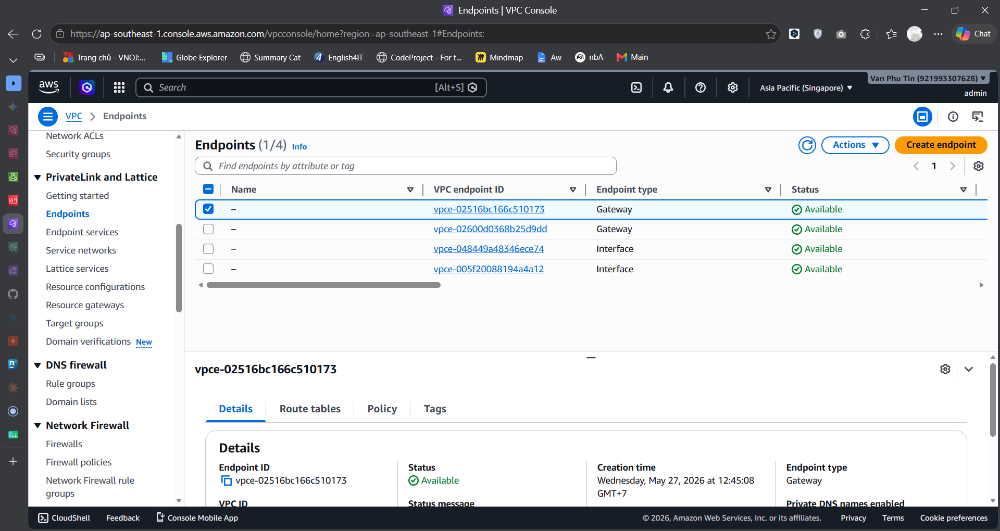


### Bảo Mật Đối Tượng

- Các bucket S3 phải được bật Block Public Access (Chặn truy cập công khai).
- CloudFront phân phối các asset frontend; quyền truy cập S3 trực tiếp công khai phải được chặn.
- Tài liệu tải lên và các tạo tác học tập sinh ra được lưu trữ trong S3 dưới các tiền tố (prefix) giới hạn.

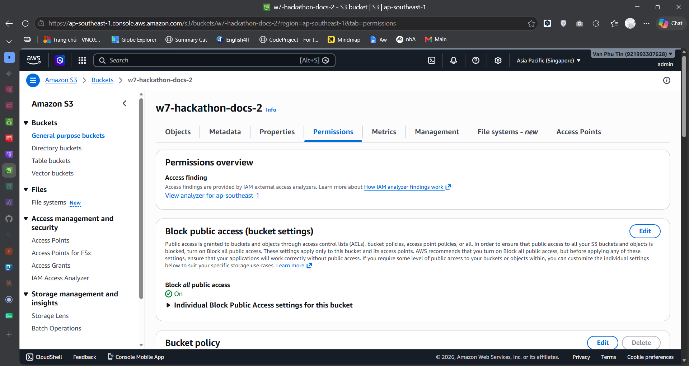

## 6. Giám Sát

CloudWatch được sử dụng cho log, số liệu (metrics), dashboard và cảnh báo (alarms).

Bằng chứng cần thu thập:

| Bằng chứng | Những gì cần thể hiện |
|---|---|
| `19_cloudwatch_dashboard.png` | Dashboard `StudyBot-G15` hiển thị số lượt gọi/lỗi/thời lượng của Lambda và các request API Gateway. |
| `20_alarm_query_errors.png` | Cảnh báo `StudyBot-G15-QueryErrors` ở trạng thái OK hoặc ALARM, không phải INSUFFICIENT_DATA. |
| `21_alarm_upload_errors.png` | Cảnh báo `StudyBot-G15-UploadErrors` ở trạng thái OK hoặc ALARM. |
| `23_custom_metrics.png` | Namespace `StudyBot`, ví dụ: `FlashcardGenerationLatency`, `FlashcardGenerationSuccess`, `SocraticQueryLatency`. |

Truy vấn Log Insights được đề xuất:

```sql
fields @timestamp, @message
| filter @message like /flashcard|query|evaluate|ERROR|WARN/
| sort @timestamp desc
| limit 50
```

### 6.1 Ghi Log Có Cấu Trúc và CloudWatch Logs Insights

Nhóm đã triển khai ghi log JSON có cấu trúc trong Lambda bằng Python `logging` và `json.dumps(...)`. Các helper `log_event()` và `log_step()` giúp mọi log có dạng truy vấn được bằng CloudWatch Logs Insights thay vì chỉ là text tự do.

Các loại log đang được phát ra:

- `DOCUMENT_UPLOAD`
- `UPLOAD_ERROR`
- `RAG_QUERY`
- `RAG_ERROR`
- `PROCESS_STEP`
- `EVALUATE_RESULT`
- `EVALUATE_ERROR`

**Bằng chứng code ghi log**

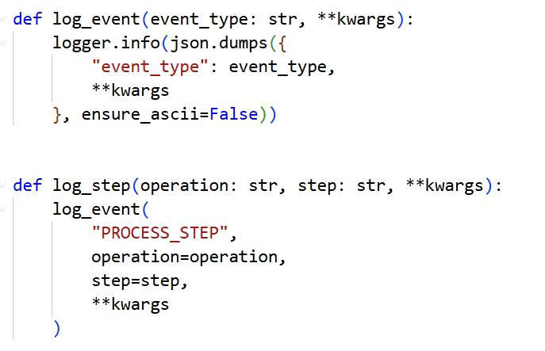

Ảnh này thể hiện `log_event()` và `log_step()` được dùng để ghi log có trường `event_type` cùng các metadata như `operation`, `step`, `user_id`, `doc_id`, `filename`.

**Bằng chứng log group**

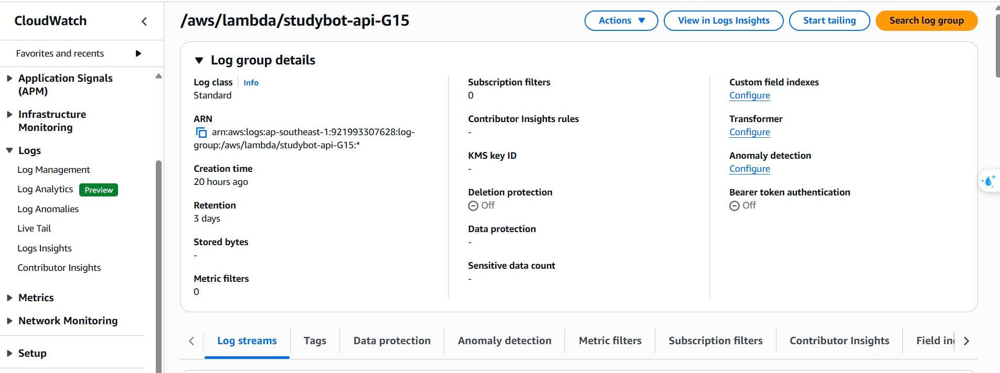

Log group `/aws/lambda/studybot-api-G15` xác nhận Lambda đã gửi log thực tế lên CloudWatch Logs, retention được cấu hình 3 ngày để phù hợp demo hackathon và kiểm soát chi phí.

**Bằng chứng log JSON**

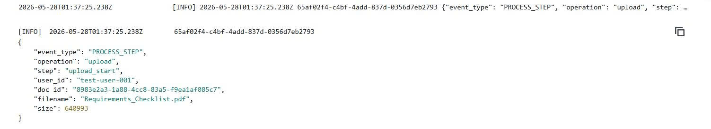

Log mẫu cho thấy một event `PROCESS_STEP` của luồng upload, gồm `operation: upload`, `step: upload_start`, `user_id`, `doc_id`, `filename`, và `size`.

### 6.2 Truy Vấn Giám Sát Upload

CloudWatch Logs Insights được dùng để theo dõi upload thành công và lỗi upload.

**Upload thành công**

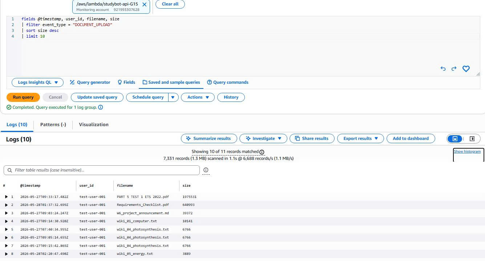

```sql
fields @timestamp, user_id, filename, size
| filter event_type = "DOCUMENT_UPLOAD"
| sort size desc
| limit 10
```

Truy vấn này giúp kiểm tra các tài liệu đã upload, kích thước file lớn nhất, và hoạt động ingestion thực tế của người dùng demo.

**Lỗi upload**

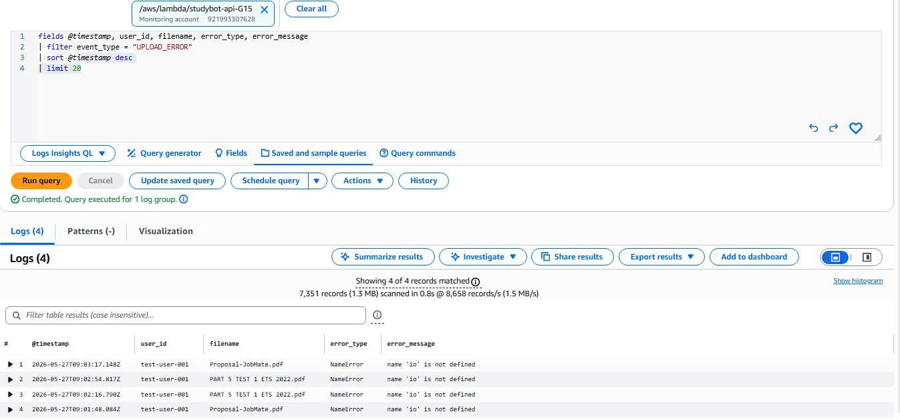

```sql
fields @timestamp, user_id, filename, error_type, error_message
| filter event_type = "UPLOAD_ERROR"
| sort @timestamp desc
| limit 20
```

Kết quả ghi nhận lỗi `NameError: name 'io' is not defined` khi upload một số PDF. Đây là bằng chứng về chế độ lỗi minh bạch, giúp nhóm debug ingestion thay vì chỉ chứng minh luồng thành công.

### 6.3 Truy Vấn Mức Sử Dụng, Độ Trễ và Lỗi RAG

**Số lượng câu hỏi RAG theo user**

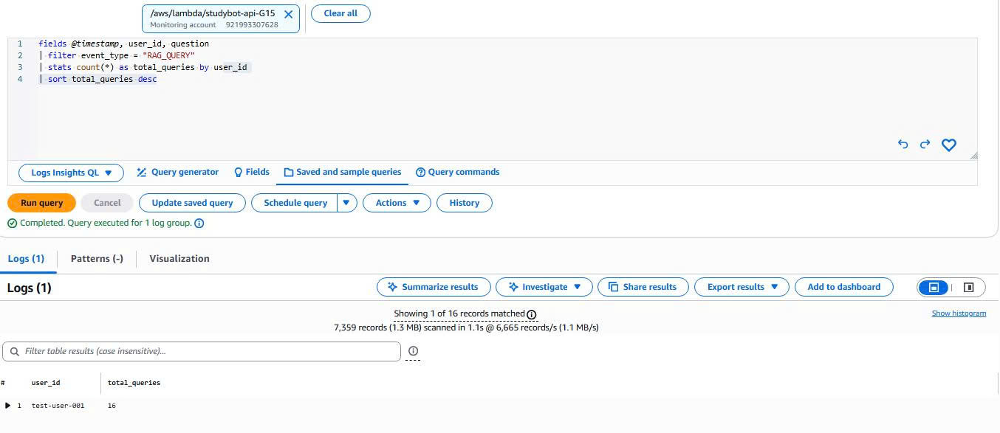

```sql
fields @timestamp, user_id, question
| filter event_type = "RAG_QUERY"
| stats count(*) as total_queries by user_id
| sort total_queries desc
```

Kết quả cho thấy user demo `test-user-001` có `16` truy vấn RAG, dùng để đo mức sử dụng của tính năng hỏi đáp.

**Độ trễ RAG**

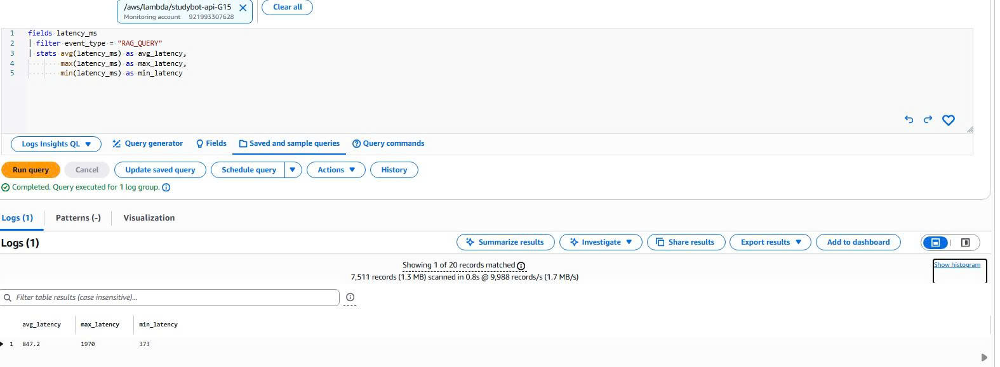

```sql
fields latency_ms
| filter event_type = "RAG_QUERY"
| stats avg(latency_ms) as avg_latency,
        max(latency_ms) as max_latency,
        min(latency_ms) as min_latency
```

Kết quả đo được `avg_latency = 847.2 ms`, `max_latency = 1970 ms`, `min_latency = 373 ms`. Các số này chứng minh nhóm không chỉ gọi được RAG mà còn có số liệu hiệu năng để đánh giá vận hành.

**Lỗi RAG**

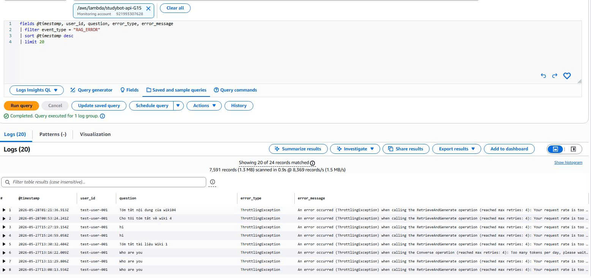

```sql
fields @timestamp, user_id, question, error_type, error_message
| filter event_type = "RAG_ERROR"
| sort @timestamp desc
| limit 20
```

Kết quả cho thấy các lỗi `ThrottlingException` từ Bedrock `RetrieveAndGenerate` và một lỗi Converse do quá nhiều token. Đây là bằng chứng hệ thống có log để phát hiện giới hạn quota/token trong quá trình demo.

### 6.4 Theo Dõi Từng Bước Xử Lý Trong Lambda

Log `PROCESS_STEP` được dùng để theo dõi từng bước trong Lambda: upload, list docs, nhận query, gọi Bedrock retrieval/generation, lưu lịch sử truy vấn, và hoàn tất request.

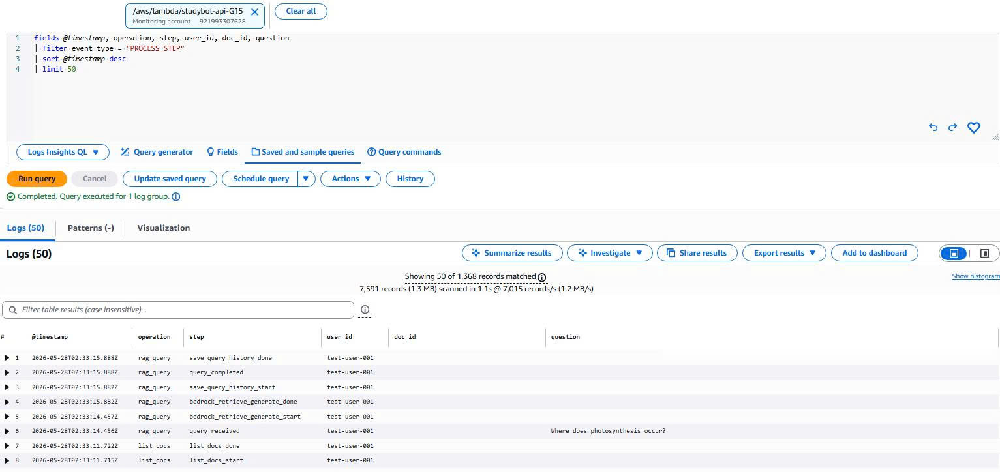

```sql
fields @timestamp, operation, step, user_id, doc_id, question
| filter event_type = "PROCESS_STEP"
| sort @timestamp desc
| limit 50
```

Kết quả hiển thị các bước như `query_received`, `bedrock_retrieve_generate_start`, `bedrock_retrieve_generate_done`, `save_query_history_start`, `save_query_history_done`, giúp xác định request bị chậm hoặc lỗi ở bước nào.

### 6.5 Chỉ Số Đánh Giá Chất Lượng Truy Xuất

Hệ thống ghi log kết quả đánh giá retrieval để đo chất lượng RAG bằng Precision@K, Recall@K và MRR.

**Kết quả đánh giá**

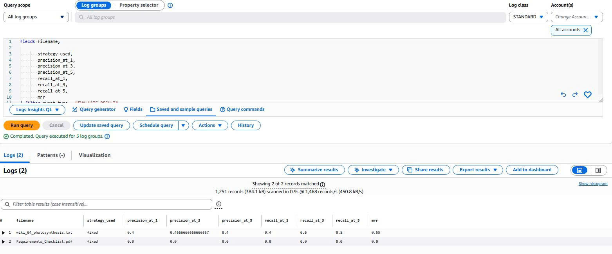

```sql
fields filename,
       strategy_used,
       precision_at_1,
       precision_at_3,
       precision_at_5,
       recall_at_1,
       recall_at_3,
       recall_at_5,
       mrr
| filter event_type = "EVALUATE_RESULT"
| sort mrr desc
```

Kết quả mẫu:

| File | Strategy | Precision@1 | Precision@3 | Precision@5 | Recall@1 | Recall@3 | Recall@5 | MRR |
|---|---|---:|---:|---:|---:|---:|---:|---:|
| `wiki_04_photosynthesis.txt` | fixed | 0.4 | 0.4667 | 0.4 | 0.4 | 0.6 | 0.8 | 0.55 |
| `Requirements_Checklist.pdf` | fixed | 0.0 | 0.0 | 0.0 | 0.0 | 0.0 | 0.0 | 0.0 |

**Lỗi đánh giá**

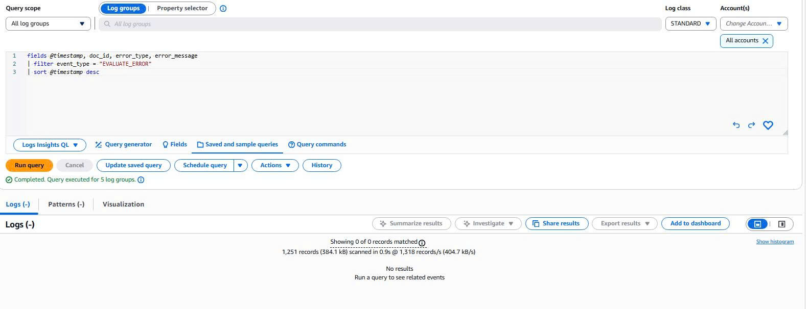

```sql
fields @timestamp, doc_id, error_type, error_message
| filter event_type = "EVALUATE_ERROR"
| sort @timestamp desc
```

Truy vấn lỗi đánh giá trả về 0 record matched, nghĩa là không có `EVALUATE_ERROR` trong log tại thời điểm chụp evidence.

## 6.6 Đo Lường và Quyết Định

### Quyết định 1: Sử dụng Claude 3.5 Sonnet cho chất lượng demo cuối, giữ Haiku là phương án rẻ hơn

**Các lựa chọn thay thế đã xem xét**

- Claude 3.5 Haiku: phương án rẻ hơn và phù hợp cho vòng dev; dùng lại Haiku nếu Cost Explorer cho thấy Bedrock trở thành cost driver lớn.
- Stub model chỉ chạy cục bộ: bị loại cho demo cuối cùng vì quy định yêu cầu gọi Bedrock thực tế từ ứng dụng, không phải từ console hay đầu ra mô phỏng.
- Các mô hình lớn hơn/dự phòng được liệt kê trong `AI_MODEL_FALLBACKS`: chỉ giữ làm dự phòng, không phải đường dẫn thông thường, để kiểm soát chi phí.

**Đo lường**

- Chạy 5 prompt đại diện trên cấu hình Sonnet đã deploy và ghi lại độ trễ trung bình: `2100 ms`.
- Ghi lại tỷ lệ câu trả lời chấp nhận được trên 5 câu hỏi học tập: `5/5`.
- Tham khảo giá từ ước tính chi phí W7: Haiku `$1.00 / 1 triệu token đầu vào` và `$5.00 / 1 triệu token đầu ra`; Sonnet cao hơn khoảng 3 lần, nên lựa chọn này phải được chứng minh bằng chất lượng câu trả lời.

**Bằng chứng**

- `24_bedrock_model_answer.png`
  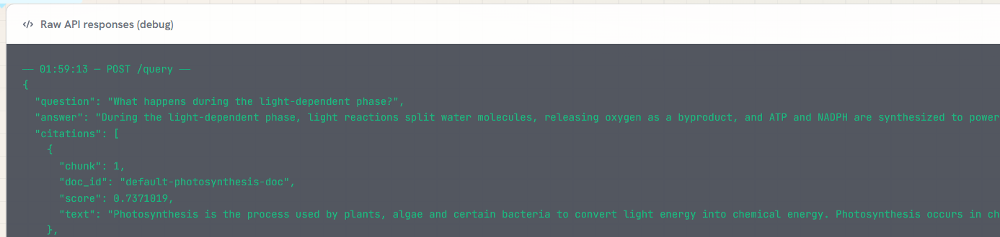
- `25_model_cost_comparison.png`
  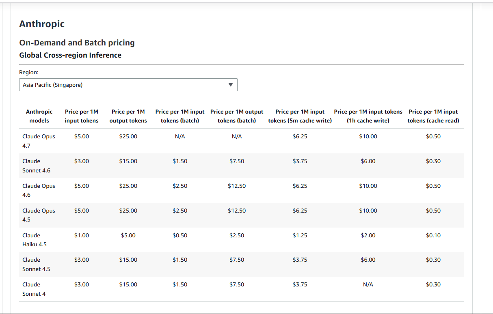
- Metric tùy chỉnh CloudWatch: `SocraticQueryLatency`
  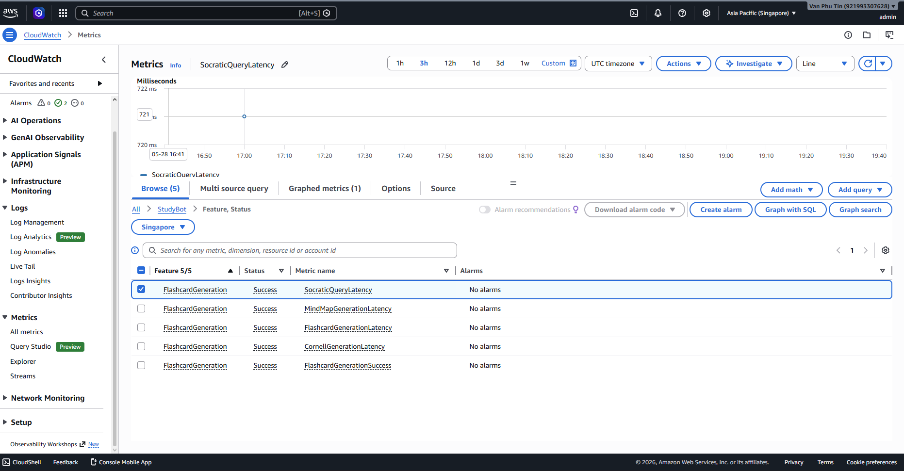

**Đánh đổi được chấp nhận**

- Sonnet tốn chi phí cao hơn Haiku. Chúng tôi chỉ chấp nhận điều này cho chất lượng demo cuối; nếu tổng chi phí tiến gần vùng cảnh báo, đổi lại Haiku trong `samconfig.toml` và cập nhật evidence.

### Quyết định 2: Sử dụng DynamoDB để duy trì trạng thái học tập thay vì RDS

**Các lựa chọn thay thế đã xem xét**

- RDS PostgreSQL: bị loại vì demo cần metadata người dùng/tài liệu/truy vấn/bài kiểm tra đơn giản, không cần các thao tác join quan hệ hay báo cáo SQL.
- SQLite: bị loại cho luồng triển khai thực tế vì truy cập đồng thời của Lambda và việc duy trì dữ liệu qua các lần triển khai yếu hơn.
- Trạng thái JSON chỉ dùng S3: bị loại đối với danh sách tài liệu/lịch sử truy vấn vì việc đọc và cập nhật cấp item dễ dàng hơn trên DynamoDB.

**Đo lường**

- TODO: Số lượng bản ghi được duy trì sau khi chạy luồng tải lên/truy vấn/bài kiểm tra cho demo: `___ items`.
- TODO: Chi phí đọc/ghi DynamoDB từ Cost Explorer: `$___`.
- Chi phí tham khảo của DynamoDB on-demand là cực nhỏ đối với lưu lượng demo: khoảng hàng trăm lượt đọc/ghi thì chi phí thấp hơn rất nhiều so với 1 đô la.

**Bằng chứng**

- `26_dynamodb_items.png`
- `27_docs_list_persistence.png`
- `28_fresh_session_persistence.png`

**Đánh đổi được chấp nhận**

- DynamoDB ít thuận tiện hơn SQL trong phân tích quan hệ đột xuất. Chúng tôi chấp nhận điều đó vì mẫu truy cập cốt lõi của StudyBot là "lấy tài liệu của người dùng này, các truy vấn gần đây, flashcard, và trạng thái bài kiểm tra".


### Quyết định 3: Thêm endpoint đo lường chất lượng truy xuất

**Các lựa chọn thay thế đã xem xét**

- Tự xem xét câu trả lời AI bằng mắt: bị loại vì nó không tạo ra bằng chứng lặp lại được.
- Một framework đánh giá offline đầy đủ: bị loại vì nó quá nặng cho 48 giờ.
- Một endpoint `/docs/{doc_id}/evaluate` nhẹ nhàng: được chọn vì nó cho biết Precision@1/3/5 và MRR trực tiếp ngay trong UI sản phẩm.

**Đo lường**

- TODO: Precision@1 = `___`.
- TODO: Precision@3 = `___`.
- TODO: Precision@5 = `___`.
- TODO: MRR = `___`.

**Bằng chứng**

- `31_rag_evaluation_metrics.png`
- `tests/test_evaluation.py`
- Bảng UI metrics trong `frontend/index.html`.

**Đánh đổi được chấp nhận**

- Quá trình benchmark sử dụng một tập câu hỏi thăm dò nhỏ, do đó đây không phải là một đánh giá học thuật toàn diện. Nó vẫn tốt hơn những tuyên bố không đo lường được và đủ để giải thích hành vi chunking/truy xuất trong quá trình hỏi đáp (Q&A).

## 6.7 CloudWatch Dashboard và Alarms

**Dashboard StudyBot-G15**

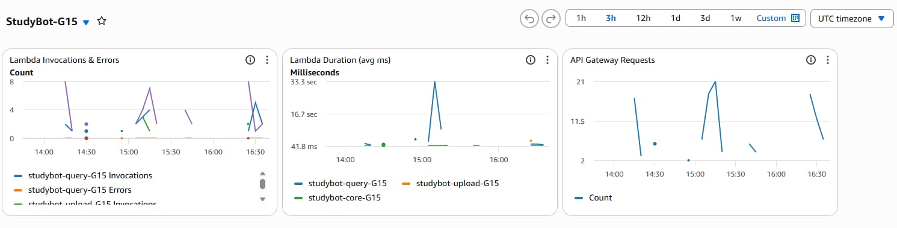

Dashboard `StudyBot-G15` tổng hợp 3 widget theo dõi toàn bộ lớp compute:
- **Lambda Invocations & Errors**: theo dõi số lần gọi và lỗi của cả 3 function `studybot-query-G15`, `studybot-upload-G15`, `studybot-core-G15` theo thời gian thực.
- **Lambda Duration (avg ms)**: đo thời gian xử lý trung bình của từng function, giúp phát hiện function nào bị chậm bất thường.
- **API Gateway Requests**: đếm số request vào hệ thống, đối chiếu với Lambda invocations để phát hiện request bị drop.

**Alarm — Query Errors**

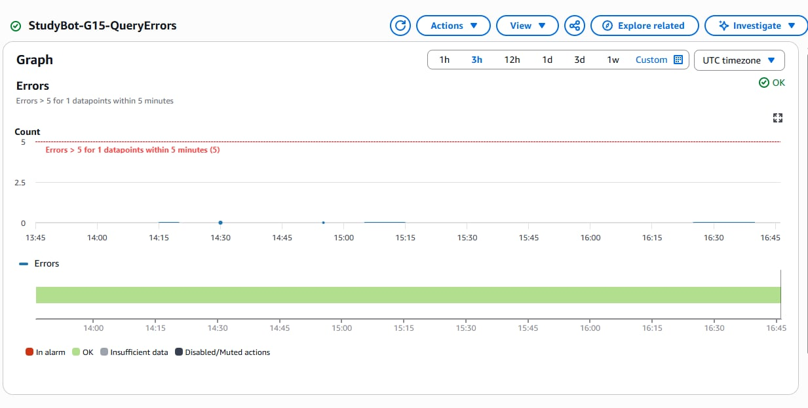

Alarm `StudyBot-G15-QueryErrors` theo dõi Lambda `studybot-query-G15`. Ngưỡng: `Errors >= 1` trong 5 phút. Trạng thái hiện tại: **OK** — xác nhận không có lỗi RAG query nào trong thời gian gần nhất. Khi alarm chuyển ALARM, SNS topic `StudyBot-G15-Alarm-Topic` gửi email cảnh báo ngay cho nhóm.

**Alarm — Upload Errors**

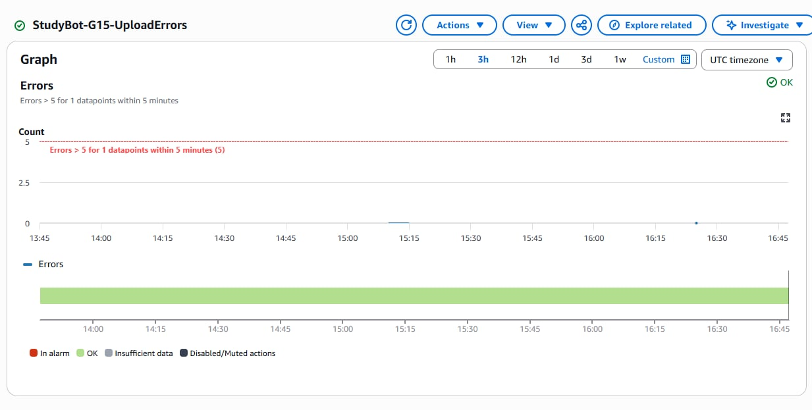

Alarm `StudyBot-G15-UploadErrors` theo dõi Lambda `studybot-upload-G15`. Ngưỡng: `Errors >= 1` trong 5 phút. Trạng thái hiện tại: **OK** — xác nhận pipeline upload PDF đang hoạt động ổn định.

## 7. Bài Học Rút Ra

StudyBot đã dạy chúng tôi rằng phần khó nhất của "trò chuyện với PDF" không phải là tải file lên; mà là làm cho câu trả lời bám sát nội dung, có thể đo lường được, và đủ rẻ để chạy liên tục. Kiến trúc serverless cho phép chúng tôi di chuyển nhanh chóng: S3 xử lý tài liệu, DynamoDB quản lý trạng thái người dùng, Lambda xử lý logic sản phẩm, và Bedrock cung cấp lớp AI. Quyết định kỹ thuật tốt nhất là thêm các tính năng định hướng bằng chứng từ sớm, đặc biệt là đánh giá RAG và các số liệu CloudWatch, vì chúng cung cấp cho chúng tôi những con số thay vì những tuyên bố mơ hồ.

Trường hợp thất bại chính mà chúng tôi nhận thấy là chất lượng truy xuất: nếu kích thước đoạn (chunking) quá lớn, câu trả lời có thể trích dẫn một phần bao quát thay vì một điểm học tập chính xác; nếu quá nhỏ, mô hình sẽ mất ngữ cảnh. Chúng tôi đã giảm thiểu điều này bằng cách đưa ra các tùy chọn chunking theo cấu trúc, ngữ nghĩa và cố định, đồng thời đo lường Precision@K/MRR trên các câu hỏi thăm dò.

Nếu có thêm một sprint nữa, chúng tôi sẽ cải thiện danh tính người dùng thay vì chỉ dùng `X-User-Id` để demo, thêm các trích dẫn rõ ràng hơn theo từng tài liệu trong UI, và benchmark nhiều lựa chọn mô hình hơn. Các công cụ thực tế như NotebookLM và Khanmigo cho thấy trải nghiệm người dùng học tập cần sự tin tưởng: các trích dẫn, tính nhất quán (persistence), và các chế độ báo lỗi minh bạch quan trọng không kém gì chất lượng văn bản sinh ra.

## 8. Kế Hoạch Dọn Dẹp (Teardown Plan)

Thời hạn dọn dẹp: Cuối ngày Chủ nhật 2026-06-01.

Trình tự dọn dẹp:

1. Lưu ảnh chụp màn hình Cost Explorer cuối cùng và các bằng chứng demo.
2. Làm trống S3 bucket của frontend và các bucket chứa tài liệu/flashcard.
3. Xóa SAM stack:

```bash
sam delete --stack-name sam-app --region ap-southeast-1
```

4. Xóa hoặc xác minh đã xóa bất kỳ Bedrock Knowledge Base/vector store nào được tạo riêng.
5. Xóa CloudFront distribution sau khi vô hiệu hóa nó nếu nó được tạo ngoài SAM.
6. Xóa bất kỳ bộ sưu tập OpenSearch Serverless nào nếu có sử dụng.
7. Xóa bất kỳ VPC endpoints, security groups, subnets, và VPC nào còn sót lại nếu chúng không thuộc quyền quản lý của stack.
8. Xóa các tài nguyên Budget/SNS nếu không có ý định giữ lại.
9. Chạy Cost Explorer sau khi dọn dẹp và chụp ảnh màn hình xác nhận.


